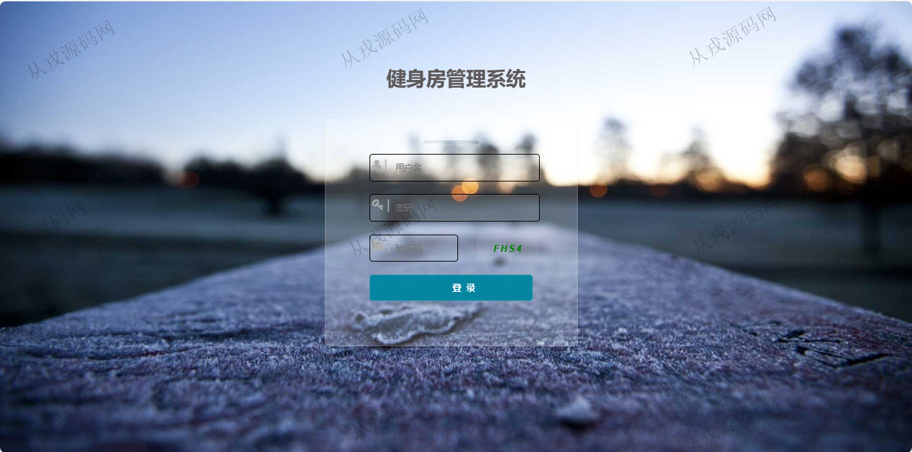
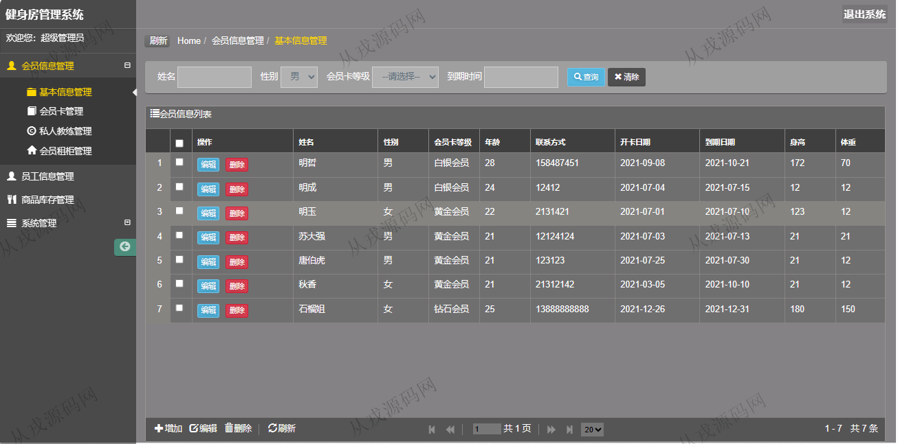
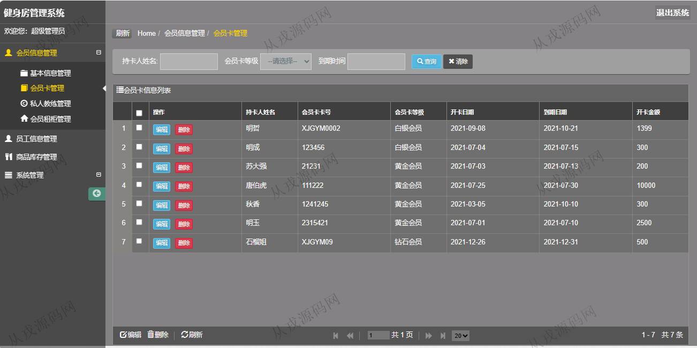
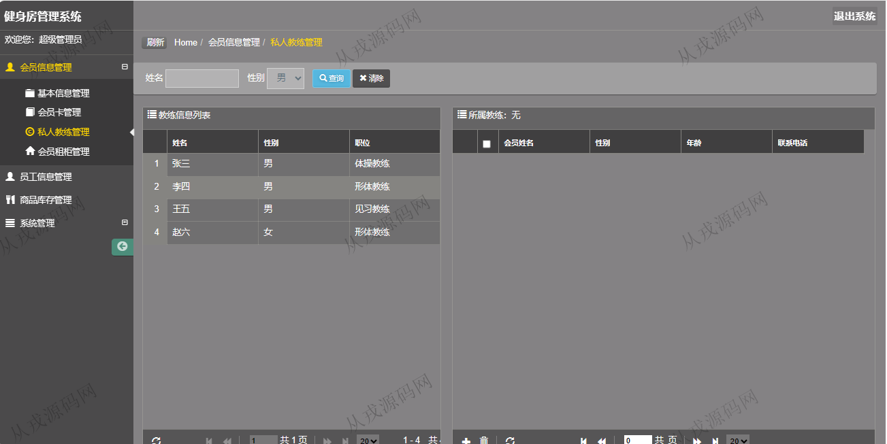
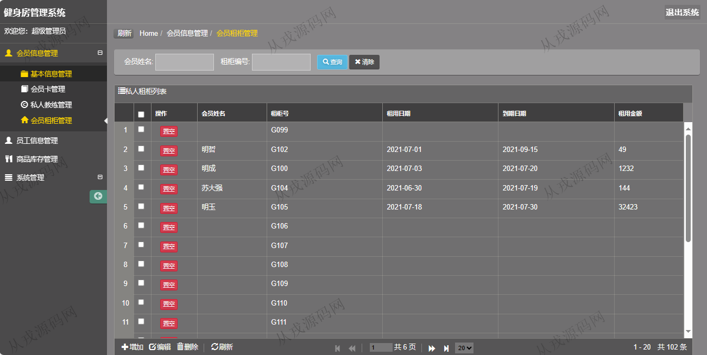
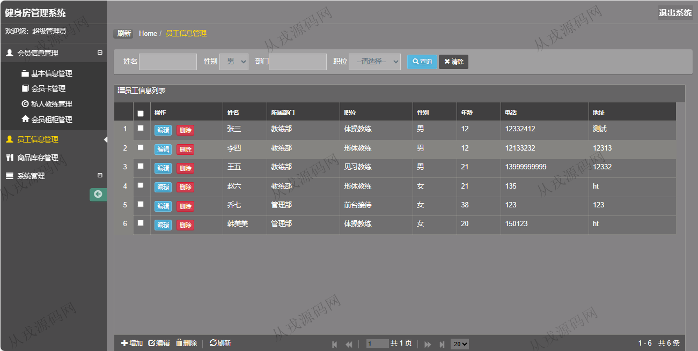
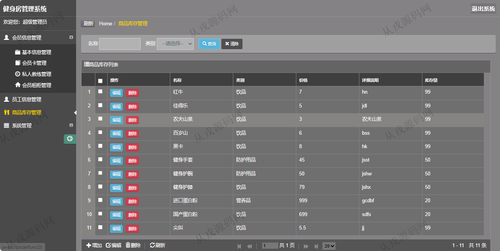
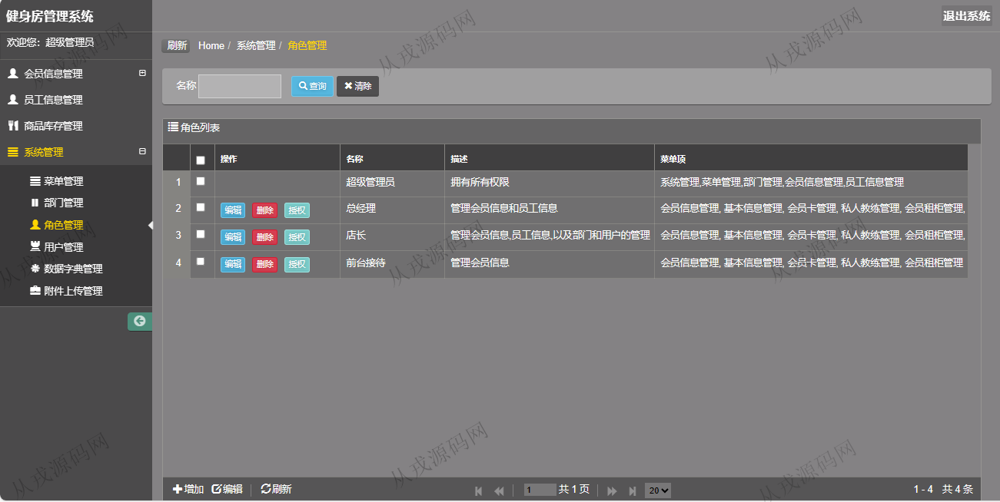

<h1 align="center">202.健身房管理系统</h1>

 获取sql文件 QQ: 386869957 QQ群: 377586148 

 [更多源码项目: 从戎源码网](https://armycodes.com/) 

## 简介

> 本代码来源于网络,仅供学习参考使用!
>
> 提供1.远程部署/2.修改代码/3.设计文档指导/4.框架代码讲解等服务
> 
> 访问地址：http://localhost:8080/
> 
> 管理员：admin admin
> 
> 

## 项目介绍
基于ssh的健身房管理系统：前端 jsp、jquery，后端 springmvc、spring、hibernate；角色分为管理员、店长；集成会员信息管理、商品库存管理、会员卡管理、私人教练管理等功能于一体的系统。

## 功能介绍

- 会员信息管理：会员信息的增删改查，多条件查询
- 会员卡管理：会员卡信息的增删改查，多条件查询
- 私人教练管理：私人教练与会员之后关系查询
- 会员租柜管理：会员租柜查询，按会员名和租柜编号搜索查询
- 员工信息管理：员工信息的增删改查
- 商品库存管理：商品库存信息的增删改查
- 系统管理：菜单管理，部门管理，角色管理，用户管理，数据字典管理，附件上传管理

## 环境

- <b>IntelliJ IDEA 2021.3</b>

- <b>Mysql 5.7.26</b>

- <b>Tomcat 7.0.73</b>

- <b>JDK 1.8</b>

## 运行截图

