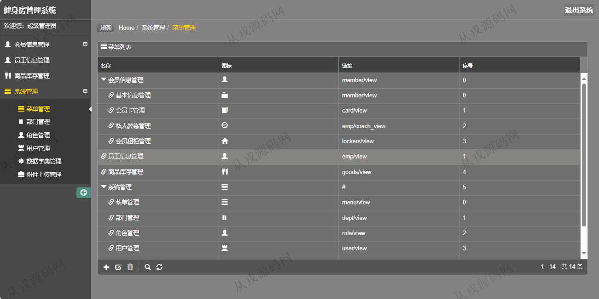

<h1 align="center">202.健身房管理系统</h1>

- <b>完整代码获取地址：从戎源码网 ([https://armycodes.com/](https://armycodes.com/))</b>
- <b>技术探讨、资料分享，请加QQ群：692619798</b> 
- <b>作者微信：19941326836  QQ：952045282</b> 
- <b>承接计算机毕业设计、Java毕业设计、Python毕业设计、深度学习、机器学习</b>
- <b>选题+开题报告+任务书+程序定制+安装调试+论文+答辩ppt 一条龙服务</b>
- <b>所有选题地址 ([https://github.com/YuLin-Coder/AllProjectCatalog](https://github.com/YuLin-Coder/AllProjectCatalog)) </b>

## 项目介绍
基于ssh的健身房管理系统：前端 jsp、jquery，后端 springmvc、spring、hibernate；角色分为管理员、店长；集成会员信息管理、商品库存管理、会员卡管理、私人教练管理等功能于一体的系统。

## 功能介绍

- 会员信息管理：会员信息的增删改查，多条件查询
- 会员卡管理：会员卡信息的增删改查，多条件查询
- 私人教练管理：私人教练与会员之后关系查询
- 会员租柜管理：会员租柜查询，按会员名和租柜编号搜索查询
- 员工信息管理：员工信息的增删改查
- 商品库存管理：商品库存信息的增删改查
- 系统管理：菜单管理，部门管理，角色管理，用户管理，数据字典管理，附件上传管理

## 环境

- <b>IntelliJ IDEA 2021.3</b>

- <b>Mysql 5.7.26</b>

- <b>Tomcat 7.0.73</b>

- <b>JDK 1.8</b>

## 运行截图

